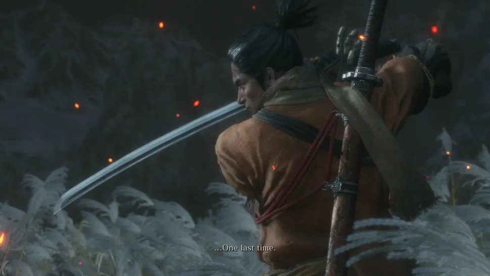
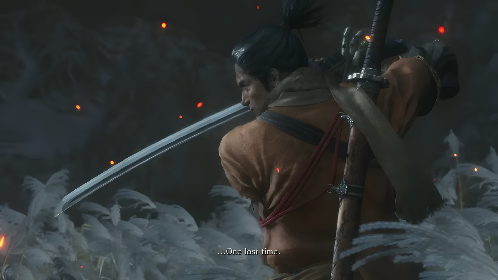

# 🖼️ UltraRes – Super-Resolution Web App using ESRGAN

UltraRes is an AI-powered web application for image super-resolution using **ESRGAN (Enhanced Super-Resolution GAN)**. It allows users to upload low-resolution images and upscale them by **2× (1080p)** or **4× (4K)** using a simple interface built with Flask and a powerful PyTorch backend.

> 🚀 No distortion. No padding. Just clean, proportional upscaling with preserved aspect ratio.

---

## 🔥 Features

- 🎯 **2× and 4× Upscaling Options** (based on 1080p and 4K)
- 🖼️ Maintains original aspect ratio (no black borders or stretching)
- 📁 Upload support for JPG, PNG, WEBP
- ⚡ Real-time image preview & download
- 🌐 Built using Flask, TailwindCSS, and PyTorch
- 🧠 Uses RRDBNet from ESRGAN for high-fidelity results

---

## 🛠️ Tech Stack

- **Frontend**: HTML5, TailwindCSS, JavaScript
- **Backend**: Python, Flask
- **Model**: ESRGAN (RRDBNet architecture)

---

## 📂 Project Structure

```
UltraRes/
├── app.py                  # Main Flask application
├── net_interp.py           # (Optional) Interpolation script
├── RRDBNet_arch.py         # ESRGAN model architecture
├── models/                 # Place downloaded ESRGAN model here
│   └── README.txt          # Contains model download link
├── static/                 # CSS, JS, and assets
    └── script.js           # JS logic for frontend interaction
    └── styles.css          # Tailwind-enhanced styles
├── templates/              # HTML files (index.html)
├── images/                 # Sample output images
└── README.md               # This file
```

---

## 📦 Setup Instructions

### 1. Clone the Repository

```bash
git clone https://github.com/AmanSheikh2004/UltraRes.git
cd UltraRes
```

### 2. Install Dependencies

```bash
pip install -r requirements.txt
# OR manually:
pip install flask torch torchvision numpy opencv-python pillow
```

### 3. 🔗 Download Pre-trained ESRGAN Model

The ESRGAN models are hosted externally.
📥 [Download from Google Drive](https://drive.google.com/drive/folders/1xmOsGLT0_ei6ss5l_IHuj7LzzdXhc6eo?usp=sharing)

After downloading, place it in the `models/` folder:

```
models/RRDB_ESRGAN_x4.pth
```

---

## 🚀 Run the App

```bash
python app.py
```

Then open your browser and go to:
```
http://127.0.0.1:5000
```

---

## ⚙️ How It Works

1. Upload a low-resolution image.
2. Select your upscale resolution:
   - **1080p** → upscale by 2×
   - **4K** → upscale by 4×
3. ESRGAN enhances the image in the backend.
4. The upscaled result is returned, previewed, and ready to download.

✅ The image resolution is scaled up, but the **original aspect ratio is preserved** — no black borders or distortion.

---

## 📊 Demo Example
| Original Image                    | 2× Upscaled                    | 4× Upscaled                    |
| --------------------------------- | ------------------------------ | ------------------------------ |
|  |  |  |
|  |  |  |


---

## 📚 ESRGAN Model

> ESRGAN: Enhanced Super-Resolution Generative Adversarial Networks  
> [Read the Paper](https://arxiv.org/abs/1809.00219)

Uses `RRDBNet` with 23 residual-in-residual dense blocks.

---

## 🚧 Future Enhancements

- Add custom upscale factor (e.g. 1.5×, 3×)
- Enable drag-and-drop uploads
- Deploy to Hugging Face Spaces or Render
- Add video frame upscaling support

---

## 🤝 Contribute

Pull requests, feedback, and feature suggestions are welcome!  
Feel free to fork the repo or open issues to collaborate.

---

## 👥 Contributors

- [Aman Ramzan Sheikh](https://github.com/AmanSheikh2004)
- [Mohammed Uvez Khan](https://github.com/mohammeduvez29)

---

## 📜 License

MIT License

---

**Crafted with ❤️ by Aman Ramzan Sheikh**
